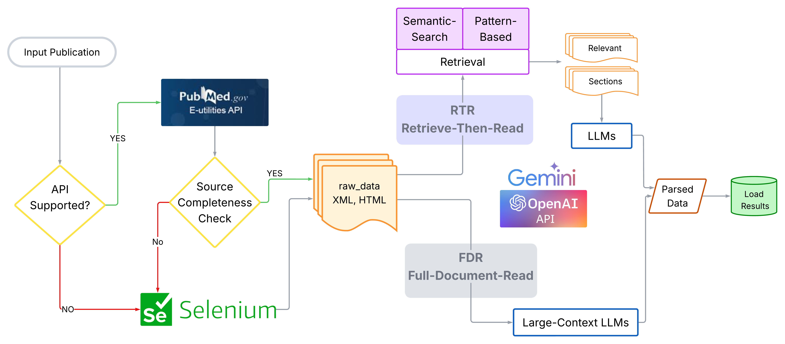

.. image:: https://readthedocs.org/projects/data-gatherer/badge/?version=latest
   :target: https://data-gatherer.readthedocs.io/en/latest/
   :alt: Documentation Status

Data Gatherer
=============

**Data Gatherer** is a Python library for automatically extracting dataset references from scientific publications.
It processes full-text articles—whether in HTML or XML format—and uses both rule-based and LLM-based methods
to identify and structure dataset citations.

What It Does
------------

- Parses scientific articles from open-access sources like PubMed Central (PMC).
- Extracts dataset mentions from structured sections (e.g., Data Availability, Supplementary Material).
- Supports two main strategies:

  - **Retrieve-Then-Read (RTR)**: First retrieves relevant sections using hand-crafted rules, then applies LLMs.
  - **Full-Document Read (FDR)**: Applies LLMs to the full text without section filtering.

- Outputs structured results in JSON format.
- Includes support for known repositories (e.g., GEO, PRIDE, MassIVE) via a configurable ontology.

Use Cases
---------

- Helping data curators and librarians identify datasets cited in publications.
- Supporting meta-analysis and secondary data discovery.
- Enabling dataset indexing and retrieval across the open-access literature.

Citation
--------

If you use Data Gatherer  in your research or project, please cite our paper:

.. code-block:: bibtex

	@inproceedings{marini_data_2025,
		title = {Data {Gatherer}: {LLM}-{Powered} {Dataset} {Reference} {Extraction} from {Scientific} {Literature}},
		url = {https://aclanthology.org/2025.sdp-1.10},
		doi = {10.18653/v1/2025.sdp-1.10},
		booktitle = {Proceedings of the {Fifth} {Workshop} on {Scholarly} {Document} {Processing} ({SDP} 2025)},
		publisher = {Association for Computational Linguistics},
		author = {Marini, Pietro and Santos, Aécio and Contaxis, Nicole and Freire, Juliana},
		year = {2025},
		pages = {114--123},
	}

